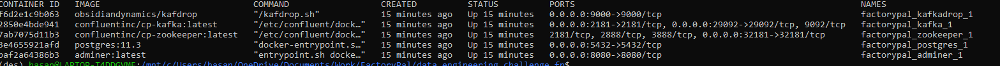
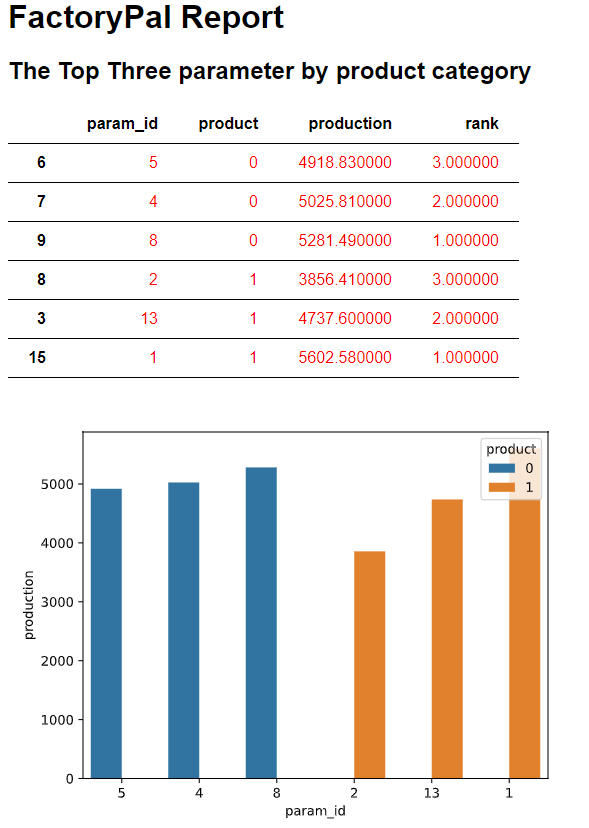
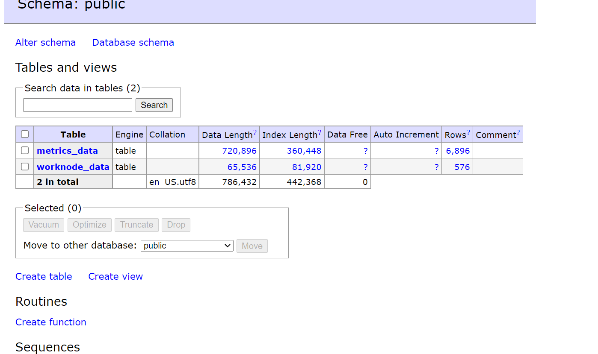

# Documentation(FactoryPal Task)

Project Structure

    - FactoryPal-Task
        - src
            - DataFactory.py
            - DBEngine.py
            - ETLFactory.py
        - report
            - template.html
        -resources
            -test_data
        -utilities
            -utility_factory.py
        - config.json
        - requirements.txt
        - docker-compose.yaml

### Creating virtual env
You must/should create a virtual env to run the program. 
Run the following command to create virtual env 

- python3 -m venv /path/to/new/virtual/environment

Or follow this instructions from the website:

- https://docs.python.org/3/library/venv.html

It is also possible to use anaconda to create virtual env. Pelase follow the follwoing instructions from the website:
    
    - https://conda.io/projects/conda/en/latest/user-guide/tasks/manage-environments.html#creating-an-environment-with-commands

Next, Please use the requirements.txt file to install necessary librarires after creating the virtual environment using following command:

 - pip install -r requirements.txt 

### Installing Docker
For the ease 0f use and installing postgresql server i have used docker image of the postgres. The docker file is already there.
To install docker please go the following website and follow the instructions:

 - https://docs.docker.com/get-docker/

## Run the program

#### Step 1:
Creating the virutal environment using the above mentioned procedure
and
activate your virtual environment using the following command -> 

You’ll need to use different syntax for activating the virtual environment depending on which operating system and command shell you’re using.

- On Unix or MacOS, using the bash shell: source /path/to/venv/bin/activate
- On Unix or MacOS, using the csh shell: source /path/to/venv/bin/activate.csh
- On Unix or MacOS, using the fish shell: source /path/to/venv/bin/activate.fish
- On Windows using the Command Prompt: path\to\venv\Scripts\activate.bat
- On Windows using PowerShell: path\to\venv\Scripts\Activate.ps1

After activating the virtual env, please run the requirements.txt file to install all libraries and dependencies.

      - pip install -r requirements.txt 

It will install all libraries needed to run the program.

#### Step 2:
You must start the kafka, zookeeper, postgressql server to run the program as the program writes data to psql database from kafka producer through the kafka consumer.

#####procedure to start pssql server using docker
        run the following command from the program directory:

            - docker-compose up
        
        check the docker container running:

            - docker ps

Here is my screenshoot:

This command will fire up the kafka, postgressql server along with adminer application. The program will now be able to connect to the demo database.
The database configuration is given and can be changed from <strong>config.json</strong> file.

## Lets Run the program (Step to Follow):
### Ingestion Step:

Once you have everything running in docker, now you are free to run the following command to start the program from the src directory:

    - python producer_client.py

It will read the two test data file and produce message to kafka topic. The two kafka topic name is pre defined by me
    
     - machine_resoruce_wo_fp
     - machine_resource_met_fp

Then you have to run the kafka consumer from the src directory:

    - python consumer_client.py

Consumer file will start consuming message from the above metnioned topics and start writing eache message in the postgres database. There will be two postgres created automatically
with the following name
    
      - metrics_data
      - worker_data

The program will keep running until you interrupt with your keyboard command (CMD+C) as this is using python multiprocessing features

### ETL and Report step:

Finally, we have to run the generate report:

    - python generate_report.py

This file will run and go through the postgres table where we are loading our data. Then do some processing by join and aggregation function to
prepare the data for making report.
The following report was produced with the test data:

Thank you

For any query, please contact me through the following email:
    
    - hasan.alive@gmail.com

### Loaded DATA Screenshoot
Here is the screenshot from adminer. You can visit the adminer after firing up the docker image

#### Asset_info Table:

